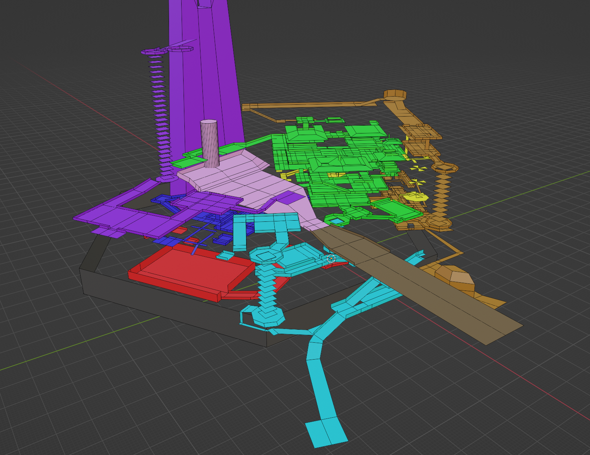

这是我对《生化危机4：重制版》与《艾尔登法环》的箱庭式关卡的一次设计尝试。通过可能性空间，高低差，环路耦合的设计，尝试创造一段比较线性的，但又充满探索乐趣的游戏体验。我利用了之前自行搭建的第三人称射击游戏模板，搭建了游戏的基本框架，撰写了关卡设计文档，利用xmind绘制了关卡动线图，利用blender制作了关卡草模，并最终在UE5中搭建了关卡白盒。策划文档和关卡图纸会以链接的形式附在下方。  

